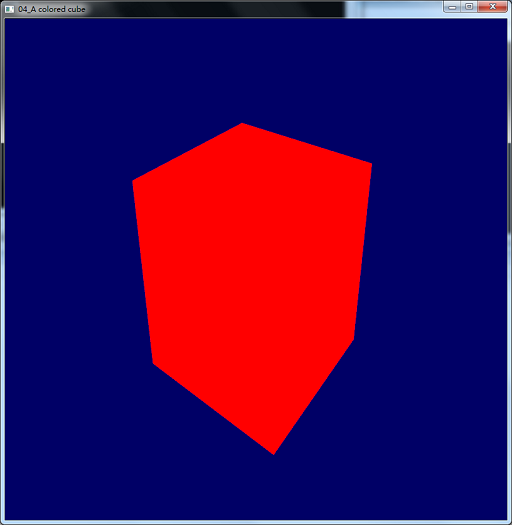

========================================================================
    控制台应用程序：04_A colored cube 项目概述
========================================================================
### 涉及到一些函数
* [GL*Buffers*()](GLBuffers.md)
* [glfwSetInputMode()](glfwSetInputMode.md)
* [glUniformMatrix4fv()](glUniformMatrix4fv.md)
* [glVertexAttribPointer()](glVertexAttribPointer.md)

### 分两步，第一步画一个红色的立方体，GLSL直接用03_Matrices的就行
运行出来的效果图保存在img文件夹中

**NOTE:** 之前一直忘了写上glfwMakeContexCurrent(window)，编译没问题，但是运行出错，到glewInit()那报错，运行不了，这里简要介绍一下这个函数的作用。
> 当你使用OpenGL或者OpenGL ES的APIs之前，需要有正确类型的当前上下文。上下文封装了所有渲染状态以及像纹理和着色器对象，需要注意的是上下文只能是针对单个线程的时间，并且一个线程只能有一个上下文时间。通过调用glfwMakeContextCurrent()一个上下文被设定成当前上下文
