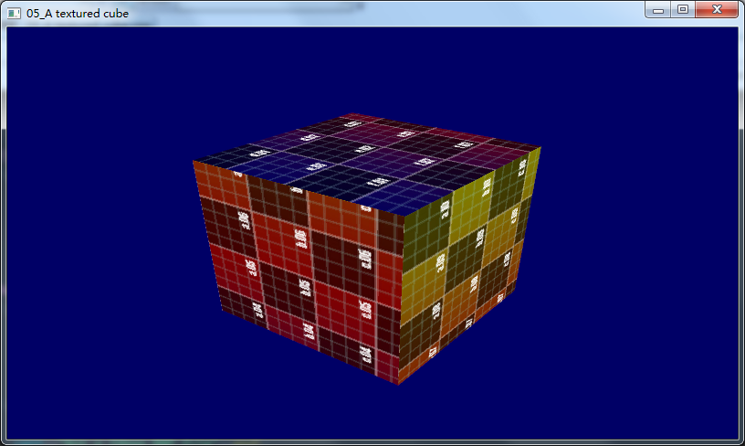
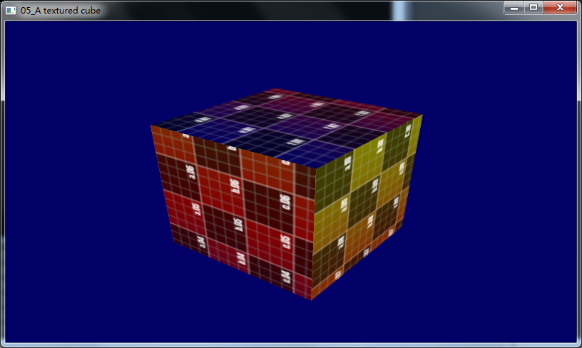
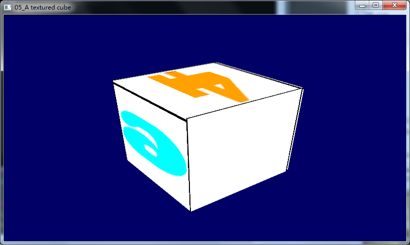

========================================================================
    控制台应用程序：05_A textured cube 项目概述
========================================================================
### 涉及到一些函数
* [glTexParameteri](glTexParameteri.md)

### 加载一个2D纹理图片，函数为loadBMP_custom
```cpp
GLuint loadBMP_custom(const char * imagepath);
```
函数的hpp,cpp文件放在`include/common`目录下，要用的时候只用把cpp文件添加到和05_A textured cube.cpp同一个目录下就行
然后要加载的图片是`uvtemplate.bmp`,直接放在了05_A textured cube.cpp同一个目录下
* 没有使用采样的效果

* 使用三次线性采样

*使用loadDDS函数加载纹理


**NOTE:** 用的C++，原版的用的C里面的fread实现的，改写为C++后用的read，打开的时候一定要注意加上ios::binary,不然的话bmp的数据会以ASCII的形式读取，得不到正确的二进制像素数据
