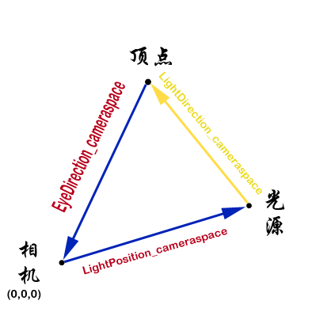
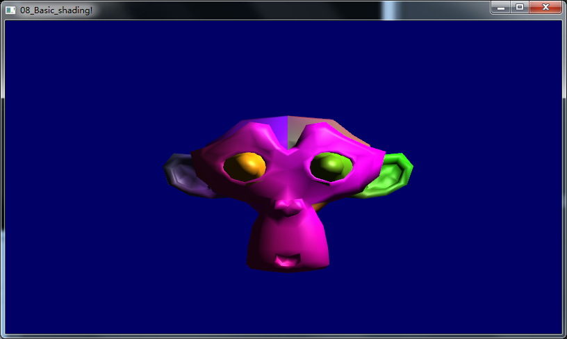

========================================================================
    控制台应用程序：08_Basic_shading 项目概述
========================================================================
### 在第八课中，我们将学习光照模型的基础知识。包括：

- 物体离光源越近会越亮
- 直视反射光时会有高亮（镜面反射）
- 当光没有直接照射物体时，物体会更暗（漫反射）
- 用环境光简化计算

### 几个函数

- vec4 texture2D(sampler2D, vec2);  
通过texture2D函数我们可以得到一个纹素(texel)(r,g,b,a)，这是一个纹理图片中的像素。函数参数分别为simpler2D以及纹理坐标：
- dot(vec3 x, vec3 y)
求两个向量的余弦，大于90度为负
- float pow(float x, float y)
计算x的y次方
- genType clamp(genType x, genType minVal, genType maxVal)
Returns min(max(x,minVal), maxVal),即限定x在[0,1]之间
- genType reflect(genType I, genType N)
返回反射向量

### 最终效果图
